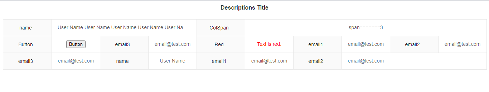

# vue-descriptions-component

> Element-UI 2.x 组件中没有`Descriptions`描述列表组件，仿照Ant Design Vue中的`Descriptions`描述列表，实现的详情描述组件，不依赖Ant Design和Element。与Antd的功能还有一些差距，可满足大部分的需求。

## Project setup
```
yarn install
```
OR
```
npm install
```

### Compiles and hot-reloads for development
```
yarn serve
```

### Compiles and minifies for production
```
yarn build
```

### Lints and fixes files
```
yarn lint
```

### Customize configuration
See [Configuration Reference](https://cli.vuejs.org/config/).

### Demo



### 使用方法

```JavaScript
<descriptions :column="4" title="Descriptions Title">
  <descriptions-item label="ColSpan" span="3">span=======3</descriptions-item>
  <descriptions-item label="Button">
​    <button @click='onclick'>Button</button>
  </descriptions-item>
  <descriptions-item label="XXX">XXX</descriptions-item>
  <descriptions-item label="XXX">XXX</descriptions-item>
  <descriptions-item label="XXX">XXX</descriptions-item>
</descriptions>
```

### API

#### Descriptions props 

| 参数   | 说明                           | 类型                   | 默认值 |
| ------ | ------------------------------ | ---------------------- | ------ |
| title  | 描述列表的标题，显示在最顶部   | string \| v-slot:title | ''     |
| column | 一行的 `DescriptionItems` 数量 | number                 | 4      |

#### Item props

| 参数  | 说明         | 类型   | 默认值 |
| :---- | :----------- | :----- | :----- |
| label | 内容的描述   | string | -      |
| span  | 包含列的数量 | number | 1      |

> span 是 Descriptions.Item 的数量。 span={2} 会占用两个 DescriptionsItem 的宽度。